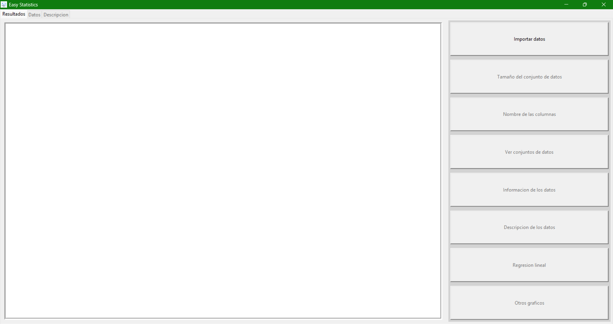
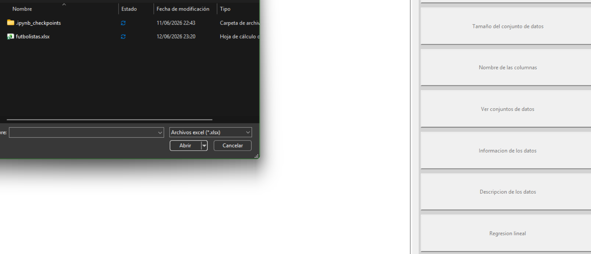
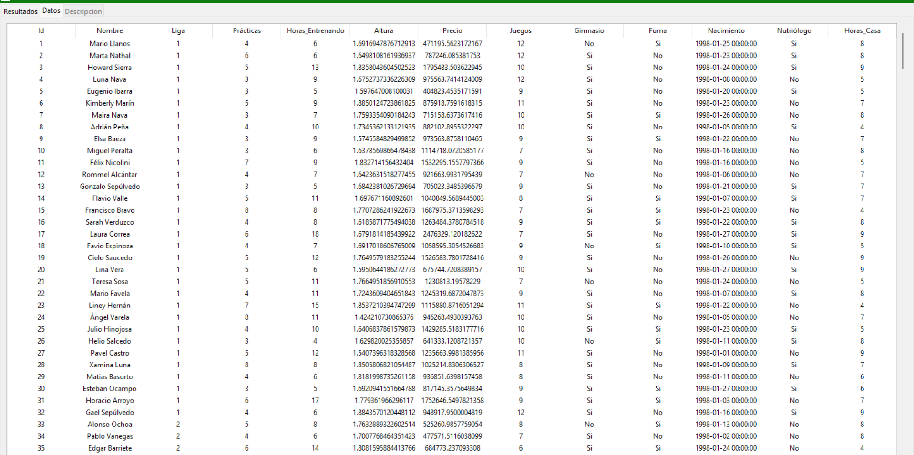
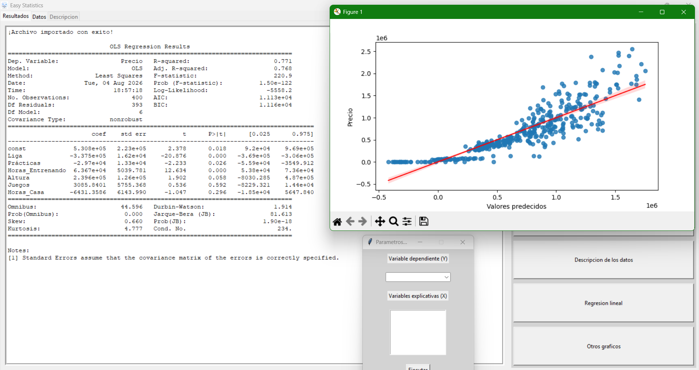

# Easy Statistics

Aplicación de escritorio hecha en Python que permite explorar datos y correr regresiones lineales sin necesidad de instalar Stata, R, ni saber programar. Pensada para estudiantes de economía que están empezando en econometría y solo necesitan un vistazo rápido a sus datos y a los resultados de una regresión.



## Características

- Importar conjuntos de datos en formato **.xlsx**, **.csv** y **.dta** (Stata)
- Ver el tamaño del conjunto de datos (observaciones y variables)
- Listar los nombres de las columnas
- Visualizar la tabla de datos completa en formato de hoja de cálculo
- Obtener información general del dataset (tipos de datos, valores no nulos, etc.)
- Ver estadísticas descriptivas de cada variable (media, desviación estándar, mínimo, máximo, etc.)
- Correr una **regresión lineal** eligiendo la variable dependiente (Y) y una o varias variables explicativas (X), con salida completa del modelo (coeficientes, errores estándar, R², p-valores)
- Gráfico de valores predichos vs. valores reales
- Matriz de correlación entre variables
- Histograma de los residuos de la regresión

## Capturas de pantalla

| Importar datos | Ver tabla de datos | Regresión lineal |
|---|---|---|
|  |  |  |

## Instalación

### Opción 1: Descargar el ejecutable (recomendada, no requiere Python)

1. Ve a la sección Releases de este repositorio
2. Descarga el archivo `EasyStatistics.exe` de la versión más reciente
3. Ábrelo directamente, sin necesidad de instalar nada más

> Windows puede mostrar una advertencia de SmartScreen la primera vez que lo abras, ya que el ejecutable no está firmado digitalmente. Esto es normal en proyectos independientes: haz clic en **"Más información"** → **"Ejecutar de todas formas"**.

### Opción 2: Correr desde el código fuente (requiere Python)

```bash
git clone https://github.com/tu-usuario/tu-repositorio.git
cd tu-repositorio
pip install -r requirements.txt
python main.py
```

Requiere Python 3.10 o superior.

## Cómo usarlo

1. Abre el programa y da clic en **"Importar datos"**
2. Selecciona tu archivo (.xlsx, .csv o .dta)
3. Una vez importado, se habilitan los demás botones para explorar tus datos
4. Para correr una regresión, da clic en **"Regresión lineal"**, elige tu variable Y, selecciona una o varias variables X, y presiona **"Ejecutar"**
5. Los resultados aparecen en la pestaña **"Resultados"**, y las tablas de datos en las pestañas **"Datos"** y **"Descripción"**

## Tecnologías usadas

- **Python 3**
- **Tkinter** — interfaz gráfica
- **pandas** — manejo y lectura de datos
- **statsmodels** — regresión lineal (OLS)
- **matplotlib** y **seaborn** — visualización de gráficos
- **PyInstaller** — empaquetado como ejecutable de Windows

## Notas y limitaciones conocidas

- Por ahora el programa no valida automáticamente valores faltantes (NaN) en las variables seleccionadas para la regresión; si tus datos tienen huecos, es recomendable limpiarlos antes de importarlos. Está planeado agregar esta validación en una futura versión.
- El ejecutable está compilado únicamente para Windows.

## Autor

Proyecto hecho por Daniel Creciente como parte de mi portafolio personal, mientras estudio economía y aprendo programación por mi cuenta. Este es mi segundo proyecto de portafolio; el primero fue [regcheck50](https://github.com/Danielpyds/regcheck50), un paquete de R para verificar los supuestos de una regresión lineal.
